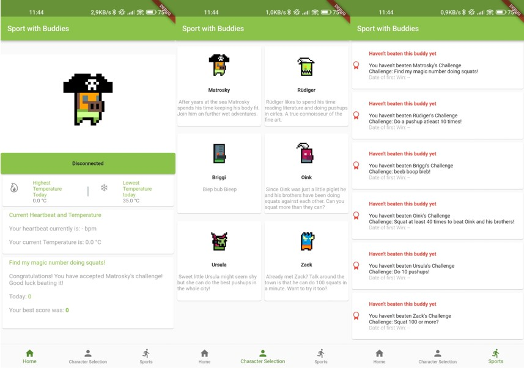

# Sport With Buddies

A Sport Challenge App written to be used with the Cosinuss° One earbuds. While doing your excercises you can compare yourself to different virtual buddies and try to beat their Highscore. Currently supported excercises include: Pushups and Squats.

## Quickstart

This project is a starting point for a Flutter application.
A few resources to get you started if this is your first Flutter project:

- [Lab: Write your first Flutter app]
- [Cookbook: Useful Flutter samples]

For help getting started with Flutter, view our [online documentation], which offers tutorials, samples, guidance on mobile development, and a full API reference.

[//]: # (These are reference links used in the body of this note and get stripped out when the markdown processor does its job. There is no need to format nicely because it shouldn't be seen. Thanks SO - http://stackoverflow.com/questions/4823468/store-comments-in-markdown-syntax)
 [Lab: Write your first Flutter app]: <https://docs.flutter.dev/get-started/codelab>
 [Cookbook: Useful Flutter samples]: <https://docs.flutter.dev/cookbook>
 [online documentation]: <https://docs.flutter.dev/>
